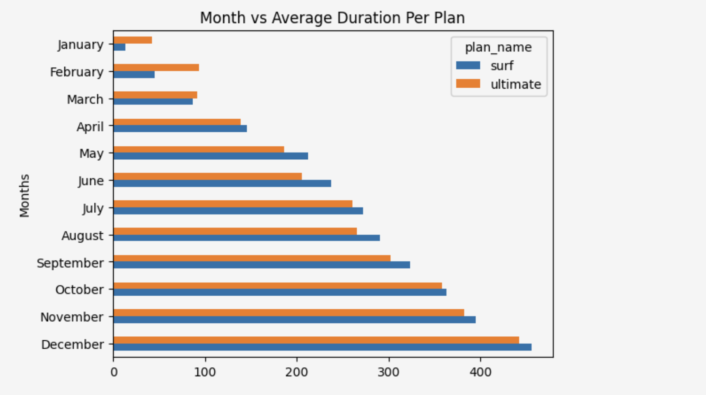
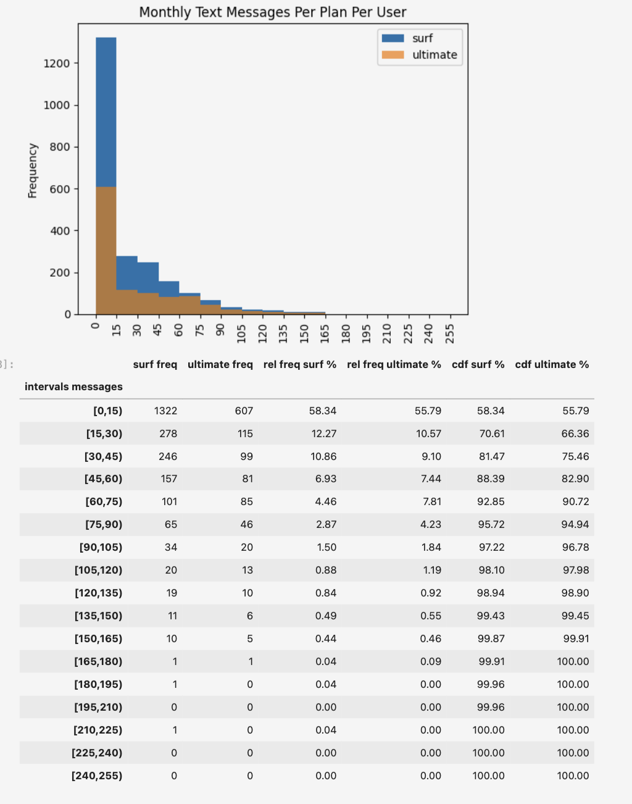
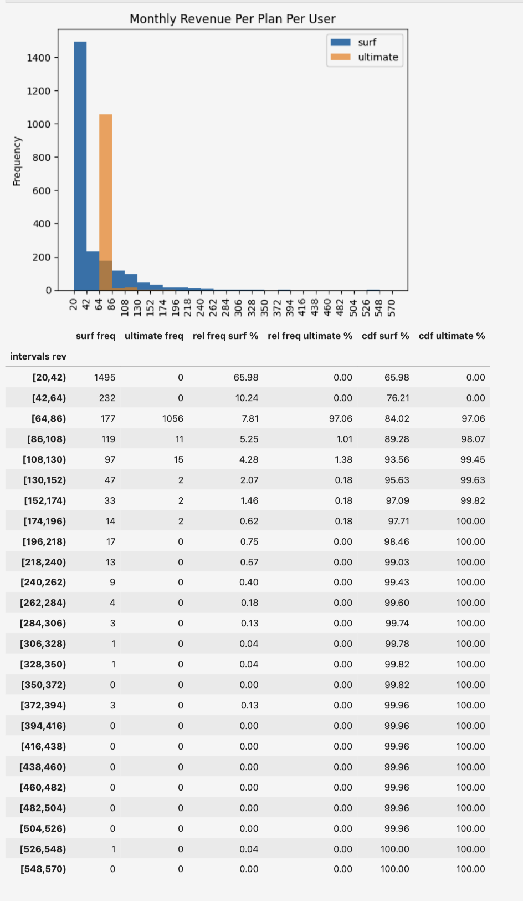

# Megaline Prepaid Plan Analysis
By James Weaver

## Introduction
This project focuses on analyzing customer behavior for the telecom operator **Megaline**[cite: 2, 1324]. [cite_start]The objective is to determine which of two prepaid plans—**Surf** or **Ultimate**—generates more revenue to help the commercial department optimize the advertising budget[cite: 4, 1326]. [cite_start]The analysis is based on a sample of 500 clients from the year 2018.

## Files
1. **SDA.ipynb** The main Jupyter Notebook containing the code for data cleaning, monthly usage aggregation, behavioral analysis, and statistical hypothesis testing.
2. [cite_start]**megaline_calls.csv, megaline_internet.csv, megaline_messages.csv, megaline_users.csv, megaline_plans.csv** Datasets containing information on clients, calls, text messages, web traffic, and plan conditions.
3. **README.md** Overview of the project, methodology, tools used, and key findings.

## Approach
1. **Data Preparation**
   - Converted data to appropriate types (dates to `datetime`, IDs to `category`).
   - Applied Megaline billing rules: rounding individual calls up to the nearest minute and monthly total web traffic up to the nearest gigabyte.
2. **Data Enrichment**
   - Aggregated usage per user per month for calls, minutes, messages, and internet data.
   - Calculated monthly revenue for each user by accounting for plan fees and overage charges.
3. **Exploratory Data Analysis (EDA)**
   - Compared the average monthly minutes, messages, and GB used across both plans.
   - Visualized usage distributions to identify patterns and outliers.
4. **Hypothesis Testing**
   - Formulated null and alternative hypotheses to test if average revenue differs between plans.
   - Tested for revenue differences between users in the NY-NJ area versus other regions.

## Tools Used
- **Python**: Core programming and data processing.
- **Pandas**: Data cleaning and monthly usage aggregation.
- **NumPy**: Numerical operations and revenue logic.
- **Matplotlib**: Creating visualizations for usage distributions.
- **SciPy**: Performing statistical hypothesis tests.

## Key Findings
1. **Sample Distribution**
   - The dataset includes 339 Surf users and 161 Ultimate users.
2. **Usage Patterns**
   - Users on both plans show very similar behavior regarding call duration and messaging.
   - Most distributions are right-skewed, showing a high concentration of users with low-to-moderate consumption.
3. **Revenue Insights**
   - The average monthly revenue for **Surf** users is approximately **$48.38**.
   - The average monthly revenue for **Ultimate** users is approximately **$71.53**.
   - Ultimate users rarely exceed their generous limits, while Surf users frequently pay overage fees.

## Visuals
### Month vs Average Duration Per Plan

### Monthly Text Messages Per Plan

### Monthly Revenue Per Plan

## Recommendations
1. **Promote the Ultimate Plan**
   - Since the average revenue per user is significantly higher for the Ultimate plan ($71.53 vs $48.38), marketing efforts should focus on upselling this plan to high-usage Surf customers.
2. **Monitor Surf Overage**
   - Surf users frequently hit limits; Megaline could benefit from a "mid-tier" plan to prevent potential churn from users frustrated by high overage fees.
3. **Regional Strategy**
   - Use the results of the NY-NJ regional hypothesis test to determine if local pricing or promotions are needed for the metropolitan area.

## Future Improvements
- Analyze the correlation between high overage fees and customer churn rates.
- Incorporate customer age and demographics into the behavioral models.
- Build a predictive model to identify which Surf users are most likely to switch to Ultimate.
